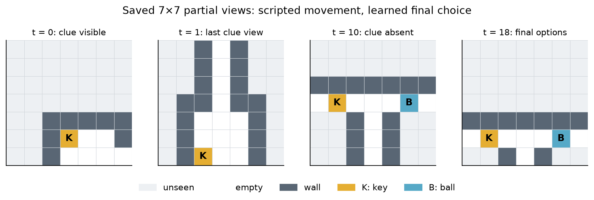

# BeliefSpec: a controlled predictive-memory pilot

**When does predictive supervision make recurrent memory more useful for later decisions?**

This exploratory pilot compares matched GRUs on scripted, partially observed MiniGrid
trajectories. The model controls the final choice, not navigation. Training is supervised;
this is not reinforcement learning, an LLM-agent evaluation, or an AgentSpec reproduction.

[Working manuscript (PDF)](manuscript/main.pdf) · [LaTeX source](manuscript/main.tex) ·
[How to defend the work](docs/defending_the_work.md) ·
[Independent verification](review/2026-10-01/verification/report.md)



The clue is last visible at step 1; this saved episode's final decision is at step 18.
The delay is 17 simulator steps. `K` means key and `B` ball. These are actual agent-visible
categorical observations, not a full-map debugging render.

## Main result

| Training seed | Task-only GRU | GRU + next-view prediction |
| --- | ---: | ---: |
| 11 | 100% | 50% |
| 22 | 100% | 100% |
| 33 | 100% | 100% |

Observed-clue success, averaged equally over delays 17, 29, and 53; each seed has
384 observed-clue test episodes. All methods scored 50% on 384 never-observed episodes.
All six main runs are retained, including predictive seed 11.

The paired mean difference is −16.67 percentage points; the descriptive 95% seed-level
t interval is [−88.38, +55.04] points (three replications, df=2). It is unstable and
conditional on these routes—not thousands of independent training replications.

The control is at ceiling. A **post-hoc** saved-observation audit found 0 differences
in 6,336 post-clue next-view targets between matched opposite-clue episodes. Predicting
these targets does not require delayed clue retention. That property does not establish
why one predictive run failed. Better prediction than an **untrained** head is a training
check, not an independent breakthrough. Fixed geometry, short budgets, and three seeds
limit interpretation. Predictive memory itself is not new.

## Reproduce without overwriting the evidence

Run from the repository root. Python 3.12 and [uv](https://docs.astral.sh/uv/) are required
for these setup commands. The original and review runs used a local Apple Silicon Mac,
macOS 15.7.7, 16 GiB RAM, CPU only, two Torch threads. Other platforms are not verified.
No GPU, API key, paid compute, or external dataset is needed.

```bash
uv venv --python 3.12 .venv
uv pip sync --python .venv/bin/python requirements.lock.txt
uv pip install --python .venv/bin/python --no-deps -e .

# Run tests in a scratch CWD: one original test writes a diagnostic there.
PROJECT_ROOT="$PWD"
mkdir -p .review-runs/tests
(cd .review-runs/tests && "$PROJECT_ROOT/.venv/bin/python" -m pytest "$PROJECT_ROOT/tests" -q)
.venv/bin/python -m ruff check src tests

# Independent record/configuration/checkpoint audit; writes only a new review file.
.venv/bin/python review/2026-10-01/verification/audit_review.py \
  --root . --stage after --output .review-runs/audit.json

# Regenerate figures from saved episode records and learning histories.
.venv/bin/python review/2026-10-01/make_figures.py --output .review-runs/figures

# Regenerate all datasets and retrain control seed 11; compare with original evidence.
.venv/bin/python -m beliefspec.reproduce --output .review-runs/reproduction
# Optional: add --all to reproduce all six original runs, not new experiments.
```

Figure and training output directories must be unused; choose new names on a repeat run.
Exact tensors reproduced on the recorded stack; bitwise equality across platforms is not
promised. Do not run the old `analyze_results`, `verify_package`, or private `package`
entry points for public packaging: they write original artifacts or include private files.

To compile the editable manuscript, install [Tectonic](https://tectonic-typesetting.github.io/book/latest/installation/)
(review build: 0.17.0), then run `cd manuscript && tectonic main.tex`. See
[build details](manuscript/README.md). Tectonic may download TeX support files.

## Inspect the evidence

- [Protocol](docs/protocol.md), [task contract](docs/task_contract.md), and
  [original decisions](docs/decision_log.md); [review decisions](review/2026-10-01/DECISIONS.md).
- `src/beliefspec/`, `tests/`, `configs/frozen.json`, and `requirements.lock.txt`.
- `data/`: separate visible arrays and evaluator-only records; no cross-split visible-history overlap.
- `runs/main/`: all six checkpoints, configurations, training curves, and selection records.
  `runs/development/` retains both development runs.
- [Raw episode outcomes](results/final/episodes.csv), [original summary](results/summary.json),
  and [new verification records](review/2026-10-01/verification/).
- [Related work](docs/related_work.md), [fresh primary-source checks](review/2026-10-01/sources.md),
  and [limited AgentSpec smoke](review/2026-10-01/agentspec_public_note.md).
- [Three proposed follow-ups](docs/followup_plan.md): target relevance, information gathering,
  and stale-clue adaptation. **None was executed.** Each needs a fresh protocol and test set.

The 50-file experiment freeze remains intact. New review tests passed (22/22); a fresh
control-seed-11 run exactly reproduced checkpoint tensors and all 768 test decisions.
Older reports are preserved as dated historical artifacts, including their then-current
publication status. The initial Git commit is a truthful import, not reconstructed history.

This is ready for exploratory research discussion, not a public preprint contribution.
The manuscript is a working draft, not peer-reviewed. Substantial AI-assisted engineering,
execution, and drafting are disclosed in [attribution and provenance](THIRD_PARTY.md).
Author identity and personal contribution must be supplied honestly. No project-wide reuse
license has been selected. Private application drafts and personal-path logs remain local;
no email, application, or preprint has been submitted by this packaging task.
