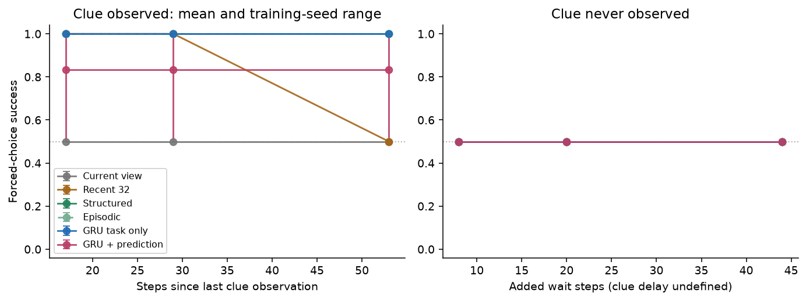
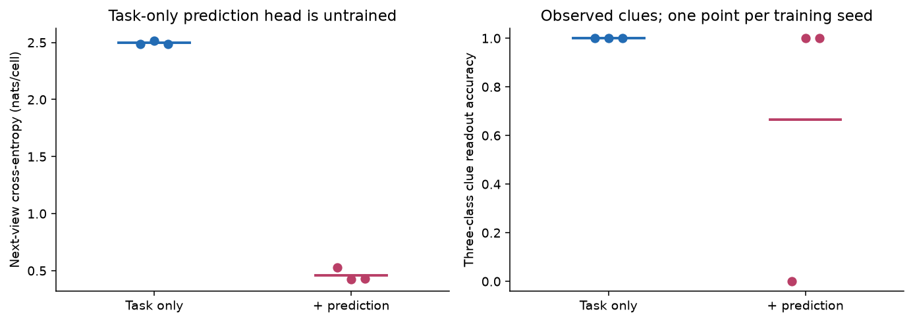
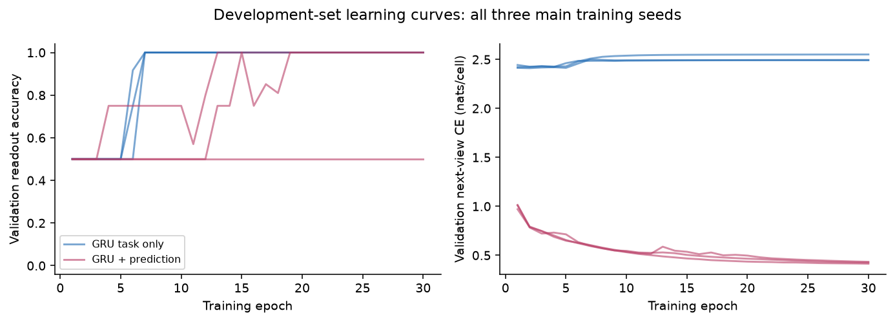

# BeliefSpec pilot report

Date: 2026-10-01. This is a standalone exploratory engineering pilot for lab outreach, not a publication claim, AgentSpec integration, or MiniGrid benchmark result.

Summary: task-only GRUs scored 100% on observed clues in all three seeds; predictive GRUs scored 50%, 100%, and 100%. Every method scored 50% when clues were never observed. Better local prediction did not reliably improve decisions in this setting. This is an optimization-sensitive pilot with a ceiling control, suitable for exploratory mentorship discussion rather than a public preprint.

## Page 1: Question, context, and prior work

BeliefSpec asks a deliberately narrow question: under what controlled conditions does predictive supervision make an agent's memory more useful for decisions? The pilot compared two matched recurrent memory models on a controlled MiniGrid Memory adaptation. Both models received the same visible observation/action histories and trained on the same supervised final clue-readout objective. The predictive variant added an auxiliary action-conditioned next-observation objective. The model did not navigate freely: a scripted, clue-independent controller moved to the final choice point, and each method controlled only the final top/bottom decision.

The lab connection is strongest to [AgentSpec](https://arxiv.org/abs/2606.14674), "AgentSpec: Understanding Embodied Agent Scaffolds Through Controlled Composition" by Jixuan Chen et al., including Lianhui Qin. AgentSpec studies controlled composition of embodied-agent modules such as memory and reasoning. This pilot follows that spirit at a much smaller scale by isolating one memory-training mechanism. It does not use AgentSpec as its runtime. The local AgentSpec smoke test passed 11 offline contract tests, while the documented MiniGrid quickstart stopped because API credentials were intentionally unset.

The closest direct prior is Gregor et al., [Shaping Belief States with Generative Environment Models for RL](https://arxiv.org/abs/1906.09237) (2019), which trained recurrent belief states with generative prediction losses. [PlaNet](https://arxiv.org/abs/1811.04551) and [Dreamer](https://arxiv.org/abs/1912.01603) show broader latent world-model decision systems. [WorldEvolver](https://arxiv.org/abs/2606.30639) and [3D-Belief](https://arxiv.org/abs/2605.11367) operate at different scales and interfaces. Full verified titles/authors are in the related-work matrix. These sources support the motivation, not novelty. Predictive memory itself is not new.

The prespecified primary contrast was predictive minus control forced-choice success on observed-clue test episodes, averaged equally across measured delays and paired by training seed. The three training seeds were 11, 22, and 33. No run was excluded.

<!-- pagebreak -->

## Page 2: Task, models, and validity controls

The task used `MemoryEnv(size=13, random_length=False)` with 7x7 egocentric object-id observations. The clue was initially visible, then hidden by movement down a corridor; the final view exposed two choice objects. The generator crossed hidden clue, top-choice identity, exposure condition, and delay. Observed-clue delays were 17, 29, and 53 simulator steps since the last actual clue observation. Never-observed episodes masked the clue during clue-visible frames and served as chance controls. Train, validation, and test visible histories had zero overlap, but all used one fixed geometry, so there is no layout-generalization claim.

Six methods shared the same final decision interface: current observation only, recent observation/action history, structured observed memory, episodic retrieval, GRU task-only control, and matched GRU with predictive supervision. The memory interface produced probabilities over key, ball, and unknown. Unknown was explicit, and the forced binary decision converted unknown to a balanced tie contribution. Three-class readout accuracy was reported separately from binary success.

Both learned variants used the same encoder width 48, GRU hidden size 32, batch size 64, Adam learning rate 0.003, gradient clipping 1.0, 30 epochs, 720 updates per run, and checkpoint selection by minimum validation task cross-entropy. Each allocated 56,171 parameters: 34,611 shared encoder/recurrent/readout parameters plus a 21,560-parameter prediction head. The control run allocated the prediction head for accounting, but only 34,611 parameters were active; its prediction-head metrics are an untrained contrast, not a trained baseline.

Task labels came from permitted observed history, with unknown for masked clues. The predictive loss added 0.1 times categorical next-view cross-entropy: state and action at t predict object IDs at t+1, excluding padded transitions. Object IDs were one-hot categories, not continuous distances. Public controller phase and prior action were shared inputs; mission, seed, simulator truth and evaluator metadata were excluded.

Validation gates covered observation/target alignment, masking, reset behavior, split overlap, structured-memory solvability, tiny-subset fitting, prediction gradients, and save/load consistency. The final audit recorded 1,536 train episodes, 384 validation episodes, 768 test episodes, observed delays [17, 29, 53], and zero train/validation/test visible-history overlap. Package checks verified 50 frozen files, 1,920 hidden-swap checks, 768 simulator replays, 30,720 intervention rows, and exact fresh-environment reproduction for control seed 11.

<!-- pagebreak -->

## Page 3: Main results

Figure 1. Decision success on held-out paired test episodes. Points are seed means; bars span the three seeds' minimum and maximum, not a confidence interval. Control reached 100% for every seed/delay. Predictive seeds 22 and 33 reached 100%; seed 11 stayed at 50% at every delay.

The primary seed-level results were:

| training seed | control observed success | predictive observed success | predictive-control |
| --- | ---: | ---: | ---: |
| 11 | 100% | 50% | -50 pp |
| 22 | 100% | 100% | 0 pp |
| 33 | 100% | 100% | 0 pp |

The mean paired difference was -16.667 percentage points, with sample SD 28.87 percentage points and a descriptive 95% t interval of [-88.38, +55.04] percentage points using df=2. This interval is unstable and reflects three training replications, not thousands of independent episode replications. Every never-observed condition was 50% success, as expected for balanced forced choice when the clue was unavailable.

The deterministic baselines behaved as validity checks. Current observation stayed at 50% for observed clues because the clue was gone at decision time. Recent history solved delays 17 and 29 but dropped to 50% at delay 53, matching the 32-record window limit. Structured observed memory and episodic retrieval solved all observed-clue delays and stayed at 50% on never-observed controls.

Figure 2. Each dot is one seed; horizontal lines are means. On observed-clue episodes, next-view CE/accuracy were: control seed 11, 2.4886/0.1180; control 22, 2.5180/0.0815; control 33, 2.4858/0.0717; predictive 11, 0.5273/0.7633; predictive 22, 0.4258/0.7963; predictive 33, 0.4306/0.7918. Copy-current-view accuracy was 0.5999. Control heads were untrained.

<!-- pagebreak -->

## Page 4: Mechanisms, failures, and compute

Figure 3. Training curves show the main asymmetry. Control seeds first reached at least 99% validation readout accuracy at epoch 7 and selected epoch 30. Predictive seeds 22 and 33 first reached it at epochs 13 and 15 and selected epoch 30. Predictive seed 11 never reached the threshold and selected epoch 10 by the prespecified minimum validation task CE rule. Continuing training to epoch 30 did not produce a better selected task checkpoint.

Readout quality explains the observed decision failure. Control seeds had observed-clue readout accuracy 1.0 and never-observed readout accuracy 1.0. Predictive seeds 22 and 33 matched that. Predictive seed 11 had observed-clue readout accuracy 0.0 and never-observed readout accuracy 1.0. Its failures were therefore not navigation failures or hidden-state leakage; they were incorrect or unknown decoded memory supplied to the deterministic final controller.

The saved trace `results/traces/observed_failure.json` shows a real predictive seed-11 failure: episode `test:test-w8-r0:h1:top0:seen`, delay 17, hidden clue ball, top clue key, decision probabilities p_key=0.2507, p_ball=0.2499, p_unknown=0.4994, readout unknown, forced choice top, failure class `incorrect_or_unknown_readout`. A paired observed-success trace with a key clue has almost the same uncertain probabilities but happens to choose the correct top branch. This is useful evidence about interface behavior, not evidence about causal neural dimensions.

Decoded-memory interventions confirmed the controller contract. For control seeds and predictive seeds 22/33 on observed clues, original and irrelevant metadata changes preserved success at 100%, removing memory reduced success to 50%, and swapping key/ball reduced success to 0%. For predictive seed 11, original, remove, swap, and irrelevant were all 50%, because the decoded clue was already unusable. These interventions test decoded probabilities entering a scripted controller, not an LLM's reasoning and not internal GRU units.

All six main runs completed on a local Mac, CPU only, two Torch threads. Total main training wall time was 109.224 s, peak macOS RSS 576,798,720 bytes, with CPU user/system time 121.543/32.325 s. Per-run training time was about 14.8-15.4 s for control and 20.9-21.3 s for predictive. Evaluation cost was 0.017-0.025 s for deterministic baselines and 0.153-0.180 s per learned checkpoint over 768 episodes, excluding simulator replay. These are single-run timings, not a hardware benchmark.

<!-- pagebreak -->

## Page 5: Interpretation and outreach value

The strongest supported finding is an informative limitation: in this controlled task, auxiliary next-view prediction clearly trained a better local prediction head, but did not reliably improve decision-relevant memory over three seeds. Two predictive seeds matched the ceiling control; one predictive seed converged to a prior/unknown-like readout on observed clues. Because the control model already hit 100%, the experiment cannot show a positive benefit from prediction under these conditions. It also cannot establish that predictive supervision generally harms memory. The result is compatible with several narrower explanations: the prediction target was too local, the auxiliary loss competed with task learning for one seed, the task was too easy for task-only recurrence, or the fixed-layout pilot lacked sensitivity.

A labeled post-hoc data audit made one limitation precise: across 192 observed key/ball episode pairs with matched routes/options, only the target at t=0 depended on clue identity. After the clue disappeared, 0 of 6,336 paired next-view targets differed (`results/target_dependence_diagnostic.json`). Thus this target did not require retaining clue identity over the decision delay. This deterministic task property does not identify the cause of the seed-11 optimization failure.

This package is credible for exploratory lab outreach because it is small, reproducible, honest about failures, and directly connected to memory under partial observability. It is not credible as a public preprint by itself. Missing evidence includes more independent training seeds, a non-ceiling decision task, loss-weight and longer-budget checks that isolate optimization failure from mechanism, a shuffled-target placebo, an independently registered informative prediction target, and held-out layout or task-family tests.

The work also has clear negative-space value for Project Alice. It shows that "better prediction" and "better decisions" must be measured separately. A model can predict local future observations much better than an untrained head and still fail to carry the remote clue into the decision readout. For a beginner researcher, that is a real lesson: mechanism claims need a task where the mechanism is necessary, baselines that can fail for the right reason, and uncertainty reported at the level of trained models rather than individual episodes.

Evidence trace: protocol and task contract are in `docs/protocol.md` and `docs/task_contract.md`; source positioning is in `docs/related_work.md`; execution metadata is in `artifacts/main_execution.json`; raw per-episode outcomes are in `results/final/episodes.csv`; interventions are in `results/final/interventions.csv`; figures are in `results/figures/`; traces are in `results/traces/`; reproduction evidence is in `runs/reproduction/verification.json` and package checks are in `artifacts/verification/package_checks.json`. No email, form submission, repository publication, or preprint upload was performed.
